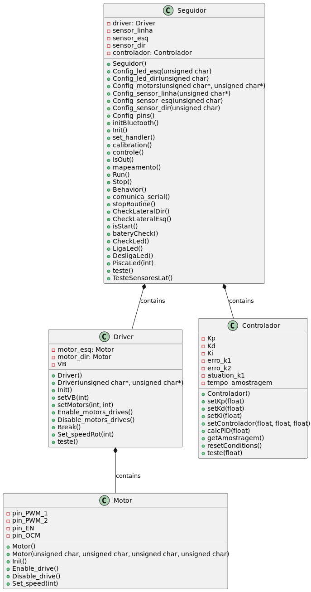

# Seguidor_Alpha

Código utilizado para controle e envio de comandos do robô seguidor de linha da equipe de competição BOTCEM UFSC.

## Índice

1. [Guia de Instalação e Execução](#Guia-de-Instalação-e-Execução)
2. [Pré-requisitos](#Pré-requisitos)
3. [Autoria e Contribuições](#Autoria-e-Contribuições)
4. [Fontes](#Fontes)
5. [Classes e Funções](#Classes-e-Funções)
    1. [Classe `Motor`](#Classe-Motor)
    2. [Classe `Driver`](#Classe-Driver)
    3. [Classe `Controlador`](#Classe-Controlador)
    4. [Classe `Seguidor`](#Classe-Seguidor)

## Guia de Instalação e Execução:

1. Extrair o arquivo zip.
2. Abrir a pasta `esp32_code` com a extensão PlatformIO do VScode.
3. Compilar o arquivo e transferi-lo para o ESP32.
4. Baixar o aplicativo Line-follower.apk.

## Pré-requisitos:

- Microcontrolador: esp32dev
- Sistema operacional: Linux 20.04
- IDE: Visual Studio Code
- Framework: Arduino

## Autoria e Contribuições:

Esse projeto é de autoria da equipe BOTCEM UFSC.

## Fontes:

Stack Overflow, c2022. Disponível em: <stackoverflow.com>. Acesso em: 18 de dezembro de 2022.

## Classes e Funções

Este projeto inclui várias classes e funções para controlar o robô. As classes incluem `Motor`, `Driver`, `Controlador` e `Seguidor`, cada uma responsável por um aspecto específico do controle do robô. As funções dentro dessas classes permitem controlar os motores, ler os sensores, calcular a saída do controlador PID, e mais.

Para obter uma descrição detalhada de cada classe e função, consulte a documentação do código-fonte. Aqui estão alguns destaques:

- `Motor`: Esta classe controla o motor de cada lado do robô.
- `Driver`: Esta classe controla os dois motores do robô.
- `Controlador`: Esta classe implementa um controlador PID (Proporcional, Integral, Derivativo).
- `Seguidor`: Esta classe é o principal controlador do robô seguidor de linha.

### Classe `Motor`

Essa classe controla o motor de cada lado do robô.

- `Motor(unsigned char PWM_1, unsigned char PWM_2, unsigned char EN, unsigned char OCM)`: Construtor da classe. Inicializa um motor com base nos pinos PWM, de habilitação (EN) e OCM.

- `void Init()`: Define os modos dos pinos como OUTPUT.

- `void Enable_drive()`: Habilita a unidade de motor acionando o pino EN.

- `void Disable_drive()`: Desabilita a unidade de motor e para o motor.

- `void Set_speed(int speed)`: Define a velocidade do motor. A velocidade pode ser positiva ou negativa, indicando a direção do motor.

### Classe `Driver`

Essa classe controla os dois motores do robô.

- `Driver(unsigned char *pins_dir, unsigned char *pins_esq)`: Construtor da classe. Inicializa os motores esquerdo e direito com base nos pinos fornecidos.

- `void Init()`: Inicializa os motores.

- `void setVB(int vb)`: Define a velocidade base dos motores.

- `void setMotors(int speed_esq, int speed_dir)`: Define a velocidade dos motores esquerdo e direito.

- `void Enable_motors_drives()`: Habilita os dois motores.

- `void Disable_motors_drives()`: Desabilita os dois motores.

- `void Break()`: Para os motores.

- `void Set_speedRot(int rot)`: Define a velocidade rotacional dos motores.

- `void teste()`: Uma função de teste que move os motores para frente e para trás.

### Classe `Controlador`

Essa classe implementa um controlador PID (Proporcional, Integral, Derivativo).

- `Controlador()`: Construtor da classe.

- `void setKp(float kp)`: Define o coeficiente proporcional do PID.

- `void setKd(float kd)`: Define o coeficiente derivativo do PID.

- `void setKi(float ki)`: Define o coeficiente integral do PID.

- `void setControlador(float kp, float kd, float ki)`: Define todos os coeficientes do PID.

- `float calcPID(float erro)`: Calcula a saída do PID com base no erro fornecido.

- `float getAmostragem()`: Retorna o tempo de amostragem do PID.

- `void resetConditions()`: Reseta as condições do PID.

- `void teste(float erro)`: Uma função de teste que imprime a saída do PID.

### Classe `Seguidor`

Essa classe é o principal controlador do robô seguidor de linha.

- `Seguidor()`: Construtor da classe.

- `void Config_...()`: Um conjunto de funções que configuram os pinos, sensores e motores do robô.

- `void initBluetooth()`: Inicializa a conexão Bluetooth.

- `void Init()`: Inicializa todos os componentes do robô.

- `void set_handler()`: Manipula os comandos recebidos pelo Bluetooth.

- `void calibration()`: Calibra os sensores de linha.

- `void controle()`: Controla os motores com base nos sensores de linha.

- `bool IsOut()`: Verifica se o robô está fora da linha.

- `void mapeamento()`: Mapeia o caminho do robô.

- `void Run()`: Inicia o robô.

- `void Stop()`: Para o robô.

- `void Behavior()`: Controla o comportamento do robô com base nos comandos recebidos pelo Bluetooth.

- `void comunica_serial()`: Lê comandos do Bluetooth.

- `void stopRoutine()`: Rotina para parar o robô.

- `bool CheckLateralDir()`, `bool CheckLateralEsq()`: Verifica se o robô chegou a um cruzamento à direita ou à esquerda.

- `bool isStart()`: Verifica se o robô está em movimento.

- `void bateryCheck()`: Verifica o nível da bateria.

- `void CheckLed()`, `void LigaLed()`, `void DesligaLed()`, `void PiscaLed(int num_piscadas)`: Funções para controlar os LEDs do robô.

- `void teste()`, `void TesteSensoresLat()`: Funções de teste para o robô.

### Diagrama de classes 

